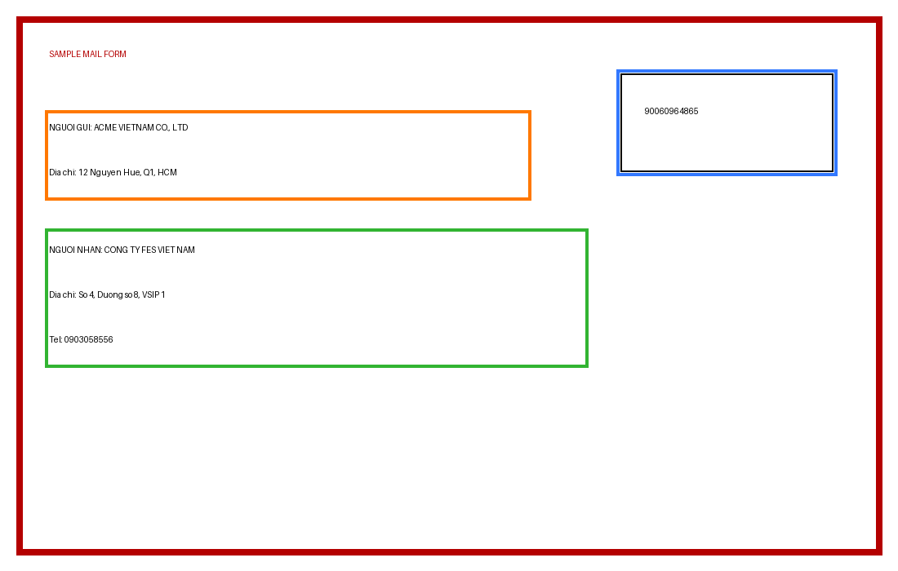

# Mail OCR NER

Hệ thống trích xuất thông tin phiếu gửi hàng tự động, chạy hoàn toàn local (không gửi ảnh ra ngoài). Sử dụng YOLOv8 để phát hiện vùng, EasyOCR / VietOCR để nhận dạng chữ, và Spring Boot + React làm giao diện web.

---

## Mục lục

- [Tổng quan](#tổng-quan)
- [Demo](#demo)
- [Yêu cầu hệ thống](#yêu-cầu-hệ-thống)
- [Cài đặt nhanh (Quick Start)](#cài-đặt-nhanh-quick-start)
- [Cài đặt chi tiết](#cài-đặt-chi-tiết)
  - [1. Clone & Python](#1-clone--python)
  - [2. MongoDB](#2-mongodb)
  - [3. Backend Spring Boot](#3-backend-spring-boot)
  - [4. Frontend React](#4-frontend-react)
- [Cấu hình môi trường (.env)](#cấu-hình-môi-trường-env)
- [Google Sheets Setup](#google-sheets-setup)
- [Gmail / SMTP Setup](#gmail--smtp-setup)
- [Sử dụng CLI](#sử-dụng-cli)
- [Sử dụng Web App](#sử-dụng-web-app)
- [Training YOLOv8](#training-yolov8)
- [Chạy tests](#chạy-tests)
- [Cấu trúc project](#cấu-trúc-project)
- [Giới hạn hiện tại](#giới-hạn-hiện-tại)

---

## Tổng quan

Pipeline xử lý một ảnh phiếu gửi hàng theo các bước:

```
raw image (JPG / PNG / HEIC)
  → normalize / rotate / deskew
  → YOLOv8 phát hiện 3 vùng: sender · receiver · barcode
  → crop từng vùng
  → OCR cục bộ (EasyOCR hoặc VietOCR)
  → parse → JSON
  → (tuỳ chọn) ghi Google Sheet + gửi email thông báo
```

Kết quả JSON mẫu:

```json
{
  "ma_van_don": "90060964865",
  "nguoi_gui": "ACME VIETNAM CO., LTD",
  "sdt_gui": null,
  "dia_chi_gui": "12 Nguyen Hue, Q1, HCM",
  "nguoi_nhan": "CONG TY FES VIET NAM",
  "sdt_nhan": "0903058556",
  "dia_chi_nhan": "So 4, Duong so 8, VSIP 1",
  "trang_thai": "Pending",
  "need_review": "NO"
}
```

Stack:

| Tầng | Công nghệ |
|------|-----------|
| ML Detection | YOLOv8 (Ultralytics) |
| OCR | EasyOCR · VietOCR · PaddleOCR (PP-OCRv3) |
| Backend API | Spring Boot 3.3 · Java 17 |
| Database | MongoDB |
| Frontend | React 18 · Vite |
| Export | Google Sheets API · Gmail SMTP |

---

## Lệnh khởi động nhanh

> Chạy 3 terminal song song.

**Terminal 1 — Backend (Spring Boot):**
```powershell
.\backend-spring\run-backend.cmd
```

**Terminal 2 — Frontend (React):**
```powershell
cd frontend
npm run dev
```

**Terminal 3 — Pipeline CLI (tuỳ chọn, test nhanh):**
```powershell
.\.venv312\Scripts\activate
python -X utf8 src/local_3field_pipeline.py "path\to\image.heic" --ocr_backend vietocr
```

| Service | URL |
|---------|-----|
| Frontend | http://localhost:5173 |
| Backend API | http://localhost:8080 |

---

## Demo



*Ảnh mẫu sử dụng dữ liệu giả. Ảnh thật và dữ liệu annotation không được commit vào repo.*

---

## Yêu cầu hệ thống

| Thành phần | Phiên bản tối thiểu | Ghi chú |
|------------|---------------------|---------|
| Python | 3.12 | Khuyến nghị dùng venv312 |
| JDK | 17 | Eclipse Temurin hoặc tương đương |
| Maven | 3.9+ | Thêm vào PATH |
| Node.js | 20+ | Đi kèm npm |
| MongoDB | 6+ | Cài service local |

> **Lưu ý đường dẫn tiếng Việt:** Java/Maven có thể lỗi nếu đường dẫn repo chứa ký tự Unicode (ví dụ `Nghĩa`). Script `run-backend.cmd` tự mount repo vào ổ đĩa `M:\` để khắc phục.

---

## Cài đặt nhanh (Quick Start)

```powershell
# 1. Clone
git clone <repo-url> mail-ocr-ner
cd mail-ocr-ner

# 2. Python venv
python -m venv .venv312
.\.venv312\Scripts\activate
pip install -r requirements.txt

# 3. Cấu hình .env
Copy-Item .env.example .env
# → Mở .env và điền các giá trị (xem mục Cấu hình môi trường)

# 4. Khởi động MongoDB (đã cài service)
Start-Service MongoDB

# 5. Backend
.\backend-spring\run-backend.cmd   # chạy trên cổng 8080

# 6. Frontend (terminal khác)
cd frontend
npm install
npm run dev                         # mở http://localhost:5173
```

---

## Cài đặt chi tiết

### 1. Clone & Python

```powershell
git clone <repo-url> mail-ocr-ner
cd mail-ocr-ner

python -m venv .venv312
.\.venv312\Scripts\activate
python -m pip install --upgrade pip
pip install -r requirements.txt
```

Model YOLO đã có sẵn trong repo tại:

```
models/yolo_regions/mail_3field/weights/best.pt
```

Không cần download thêm để chạy inference.

---

### 2. MongoDB

Cài MongoDB lần đầu (bỏ qua nếu đã cài):

```powershell
winget install --id MongoDB.Server -e
winget install --id MongoDB.Shell -e
```

Khởi động service:

```powershell
Start-Service MongoDB

# Kiểm tra kết nối
mongosh mongodb://localhost:27017/mail_ocr --eval "db.runCommand({ ping: 1 })"
```

MongoDB connection string mặc định: `mongodb://localhost:27017/mail_ocr`

---

### 3. Backend Spring Boot

Cài JDK 17 và Maven lần đầu (bỏ qua nếu đã có):

```powershell
winget install --id EclipseAdoptium.Temurin.17.JDK -e
# Maven: tải từ https://maven.apache.org/download.cgi và thêm bin/ vào PATH
```

**Cách khởi động (khuyến nghị — dùng launcher tránh lỗi Unicode):**

```powershell
.\backend-spring\run-backend.cmd
```

Script này tự gán các biến môi trường và mount repo vào `M:\` trước khi chạy Maven.

**Hoặc chạy thủ công** (chỉ khi đường dẫn không có ký tự đặc biệt):

```powershell
cd backend-spring
$env:MONGODB_URI          = "mongodb://localhost:27017/mail_ocr"
$env:MAIL_OCR_PROJECT_ROOT = "D:\Dev\mail-ocr-ner"
$env:MAIL_OCR_PYTHON      = "D:\Dev\mail-ocr-ner\.venv312\Scripts\python.exe"
$env:MAIL_OCR_BACKEND     = "vietocr"
mvn spring-boot:run
```

API sẽ lắng nghe tại: **http://localhost:8080**

---

### 4. Frontend React

```powershell
cd frontend
npm install
npm run dev
```

Mở **http://localhost:5173** trên trình duyệt.

Frontend mặc định gọi API tại `http://localhost:8080`. Thay đổi nếu cần:

```powershell
$env:VITE_API_BASE_URL = "http://your-server:8080"
npm run dev
```

Build production:

```powershell
npm run build   # output: frontend/dist/
```

---

## Cấu hình môi trường (.env)

```powershell
Copy-Item .env.example .env
```

Sau đó mở `.env` và điền đầy đủ:

```env
# Google Sheets
GOOGLE_SHEET_ID=your_google_sheet_id_here
GOOGLE_CREDENTIALS_FILE=credentials.json
GOOGLE_TOKEN_FILE=token.json

# Email callback URL (dùng trong link "Xác nhận đã nhận" trong email)
CONFIRM_BASE_URL=http://localhost:8080

# Gmail SMTP
SMTP_HOST=smtp.gmail.com
SMTP_PORT=587
SMTP_USER=your@gmail.com
SMTP_PASSWORD=your_gmail_app_password
NOTIFY_EMAIL=recipient@gmail.com
```

Các biến `GOOGLE_*` chỉ cần thiết khi dùng tính năng export Sheet. `SMTP_*` chỉ cần khi gửi email thông báo.

---

## Google Sheets Setup

Có thể dùng **OAuth Desktop** hoặc **Service Account**.

### Option A: OAuth Desktop (dành cho cá nhân)

1. Vào [Google Cloud Console](https://console.cloud.google.com/).
2. Tạo/chọn một project.
3. Bật APIs:
   - **Google Sheets API**
   - **Google Drive API**
4. Cấu hình **OAuth consent screen** (External, thêm email test).
5. Tạo **OAuth Client ID** → Application type: **Desktop app**.
6. Download file JSON → đổi tên thành `credentials.json`, đặt ở root repo.
7. Chạy lần đầu để xác thực:

```powershell
.\.venv312\Scripts\python.exe setup_auth.py
```

Trình duyệt mở ra → đăng nhập → file `token.json` được tạo tự động.

### Option B: Service Account (dành cho server / tự động hóa)

1. Bật **Google Sheets API** + **Google Drive API**.
2. Tạo **Service Account** trong Google Cloud Console.
3. Tạo và download **Service Account Key** (JSON).
4. Đổi tên thành `credentials.json`, đặt ở root repo.
5. Chia sẻ Google Sheet mục tiêu với **email của Service Account** (quyền Editor).

Không cần chạy `setup_auth.py`.

---

## Gmail / SMTP Setup

1. Bật **2-Step Verification** trên tài khoản Gmail.
2. Tạo **App Password**:
   - Google Account → Security → App passwords → chọn app "Mail" + thiết bị → Generate.
3. Dùng password đó làm `SMTP_PASSWORD` trong `.env`.

---

## Sử dụng CLI

Cần kích hoạt venv trước:

```powershell
.\.venv312\Scripts\activate
```

**Trích xuất cơ bản (EasyOCR):**

```powershell
python -X utf8 src/local_3field_pipeline.py "path\to\image.jpg"
```

**Dùng VietOCR:**

```powershell
python -X utf8 src/local_3field_pipeline.py "path\to\image.jpg" --ocr_backend vietocr
```

**Dùng PaddleOCR (PP-OCRv3, cần Python 3.12 + paddleocr installed):**

```powershell
python -X utf8 src/local_3field_pipeline.py "path\to\image.jpg" --ocr_backend paddleocr
```

**Lưu ảnh debug (crops từng vùng):**

```powershell
python -X utf8 src/local_3field_pipeline.py "path\to\image.jpg" --out_dir "debug_3field"
```

**Export lên Google Sheet và gửi email:**

```powershell
python -X utf8 src/local_3field_pipeline.py "path\to\image.jpg" --ocr_backend vietocr --export
```

**Tắt từng kênh export:**

```powershell
python -X utf8 src/local_3field_pipeline.py "path\to\image.jpg" --export --no_email   # chỉ ghi Sheet
python -X utf8 src/local_3field_pipeline.py "path\to\image.jpg" --export --no_sheet   # chỉ gửi email
```

> **Lưu ý:** Flag `-X utf8` bắt buộc trên Windows để tránh lỗi encode khi có ký tự tiếng Việt.

---

## Sử dụng Web App

Sau khi khởi động đủ 3 service (MongoDB + Backend + Frontend):

| URL | Mô tả |
|-----|-------|
| http://localhost:5173 | Giao diện chính |
| http://localhost:8080 | REST API |

Tính năng chính:

- **Upload**: kéo thả hoặc chọn file JPG / PNG / HEIC → pipeline tự chạy.
- **Human Review**: duyệt các bản ghi có `need_review = YES` (độ tin cậy thấp).
- **GG Sheet**: export bản ghi đã lưu lên Google Sheet / email / cả hai.
- **Training**: xem snapshot đã review, xác nhận trigger training khi đủ ≥ 20 snapshot.

### Cột Google Sheet (A → K)

| Cột | Trường |
|-----|--------|
| A | ma_van_don |
| B | don_vi_van_chuyen |
| C | nguoi_gui |
| D | sdt_gui |
| E | nguoi_nhan |
| F | sdt_nhan |
| G | dia_chi_nhan |
| H | noi_dung_hang_hoa |
| I | tien_thu_ho |
| J | ngay_gio_gui |
| K | trang_thai |

---

## Training YOLOv8

### Bước 1: Chuyển đổi dataset từ Roboflow COCO

Export dataset từ Roboflow dưới định dạng **COCO**, sau đó convert:

```powershell
python src/convert_roboflow_coco.py `
  --coco_dir "D:\path\to\roboflow_export.coco" `
  --out_dir "data\yolo_roboflow_3field"
```

Output là YOLOv8 dataset với 3 class: `barcode`, `receiver`, `sender`.

### Bước 2: Train

```powershell
.\.venv312\Scripts\yolo.exe task=detect mode=train `
  model=yolov8n.pt `
  data=data/yolo_roboflow_3field/data.yaml `
  epochs=80 imgsz=1024 batch=4 `
  project=models/yolo_regions name=mail_3field exist_ok=True
```

### Bước 3: Cập nhật model

```powershell
Copy-Item "models\yolo_regions\mail_3field\weights\best.pt" `
          "models\yolo_regions\mail_3field\weights\best.pt.bak"
# Thay bằng model mới từ runs/detect/...
```

---

## Chạy tests

```powershell
.\.venv312\Scripts\activate
python -m pytest tests -q
```

---

## Cấu trúc project

```
mail-ocr-ner/
├── src/                        # Core Python pipeline
│   ├── local_3field_pipeline.py    # CLI chính, điểm vào
│   ├── detect_regions.py           # YOLOv8 wrapper
│   ├── preprocessing.py            # Load ảnh, HEIC, rotate/deskew
│   ├── geometry.py                 # Perspective normalization
│   ├── export.py                   # Google Sheets + SMTP
│   ├── auth_google.py              # OAuth / Service Account
│   ├── generate_preview.py         # Tạo ảnh preview JPG
│   └── convert_roboflow_coco.py    # Roboflow COCO → YOLOv8
│
├── backend-spring/             # Spring Boot REST API
│   ├── src/main/java/com/mailocr/api/
│   │   ├── controller/             # REST endpoints
│   │   ├── service/                # PipelineService, ShipmentService
│   │   ├── model/                  # Shipment, ShipmentStatus
│   │   └── repository/             # MongoDB repository
│   ├── run-backend.cmd             # Launcher (xử lý Unicode path)
│   └── pom.xml
│
├── frontend/                   # React + Vite dashboard
│   ├── src/main.jsx                # Toàn bộ UI (Upload, Review, Sheet, Training)
│   ├── src/styles.css
│   └── package.json
│
├── models/
│   └── yolo_regions/mail_3field/weights/best.pt   # Model YOLO hiện tại
│
├── tests/                      # pytest test suite
├── docs/assets/                # Ảnh sample cho README
├── assets/                     # Training metrics (PR curve, confusion matrix...)
│
├── .env.example                # Template biến môi trường
├── requirements.txt            # Python dependencies
├── setup_auth.py               # Google OAuth flow
└── storage.json                # Runtime snapshot (git-ignored)
```

---

## Giới hạn hiện tại

- **YOLO detection** hoạt động tốt với layout phiếu gửi hàng chuẩn.
- **OCR** là điểm nghẽn chính: chữ viết tay tiếng Việt đôi khi nhận sai. Để cải thiện, cần thu thập thêm line crops đã review và fine-tune VietOCR.
- **Training loop** trong web app mới tạo manifest request. Bước training thực tế (chạy YOLO train + swap model) cần một runner riêng consume `training_runs/`.
- Đường dẫn chứa ký tự Unicode trên Windows có thể gây lỗi với Java/Maven — dùng `run-backend.cmd` để tránh.
